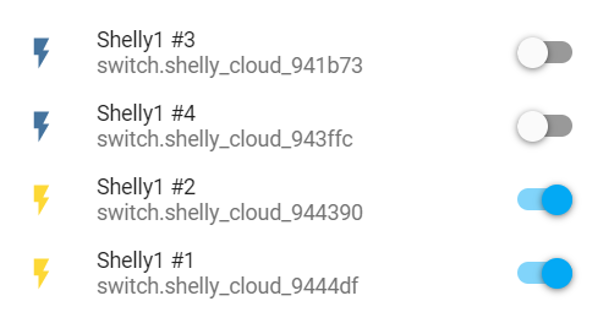

# hassio_shelly_cloud
- A Home Assistant (HA) custom-component for [Shelly Cloud](https://shelly.cloud/) devices.
   
How it works
============
- It implements an **time-driven (polling) strategy** to catch data from the Shelly Cloud server and to send commands.
- The main advantages of this approach are:
    - You don't need to activate the Mqtt on your devices, so you don't lose the Cloud service;
    - You can monitor and control your devices even outside the LAN, even if the LAN is behind a CGNAT. 
- It supports only the switch entities of HA (to turn on and off the devices)
- The work has been done reverse engineering the HTTP messages between a browser and the [Shelly Cloud web server](https://my.shelly.cloud). 
Any change in the HTTP message exchange can affect the custom-component.

Devices
============

The custom-component is intended to manage the [Shelly Cloud](https://shelly.cloud/) devices. 

The custom-component will discover the Shelly devices associated to your Shelly account and will add switches in HA, as shown in the figure below:


  

Install
============

1. Copy all the `.py` and `manifest.json` files into your `/config/custom_components/meross` folder.
- Your configuration should look like:
```
config
└── custom_components
    └── shelly_cloud
        └── __init__.py
        └── manifest.json
        └── switch.py        
```

2. Remember to **reboot** Hassio (or Home Assistant)

Configuration
============

Add your credentials to `configuration.yaml`:
- `username` and `password` are **mandatory**
- `scan_interval` is **optional**. It must be a positive integer number. It represents the seconds between two consecutive scans to gather new values of Meross devices' sensors and switches. The default value is 10 seconds. 
- `shelly_cloud_devices_scan_interval` is **optional**. It must be a positive integer number. It represents the seconds between two consecutive scans to update the list of available Meross devices. The default value is 900 seconds (15 minutes). 

For example:
```
meross:
  username: !secret meross_userame
  password: !secret meross_password
  scan_interval: 10
  shelly_cloud_devices_scan_interval: 900
```

Performances
============
Consider that the custom-component works using a **polling strategy**: it is a time-driven not an event-driven system. 
It means that there will be always a **small delay** between an action and the result of that action.

In particular:
- acting a on/off switch on HA should result in an (almost) instantaneous effect on the device and the Shelly mobile App;
- acting a on/off switch on the Shelly mobile App, should result in an (almost) instantaneous effect on the device, but you have to wait up to `scan_interval` seconds before it updates on HA;
- electricity values (power, voltage, currant) are updated approx each `scan_interval` seconds before it updates on HA;
- unplugging a device will be detected after several `scan_interval` cycles (normally less than a minute);
- plugging in a device will be detected within `scan_interval` seconds;
- registering a new device (to the associated Shelly account) will be detected within `shelly_devices_scan_interval` seconds;
- unregistering a device (from the associated Shelly account) will be detected after a HA reboot.

Debug
============

- To enable debug diagnostics, add this to your `configuration.yaml`:
```
logger:
  default: WARNING
  logs:
    shelly_init: DEBUG    
    shelly_switch: DEBUG    
```